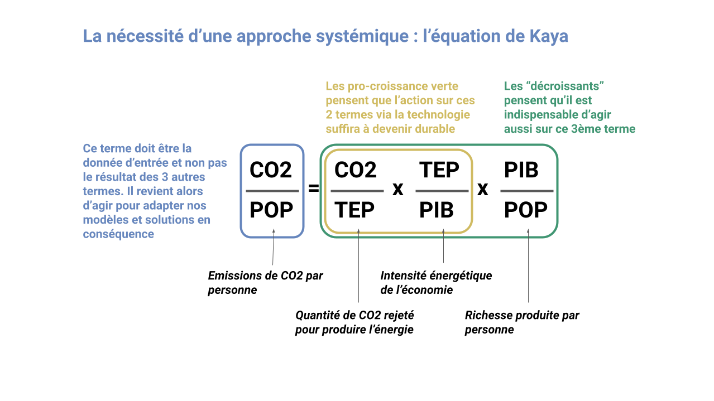
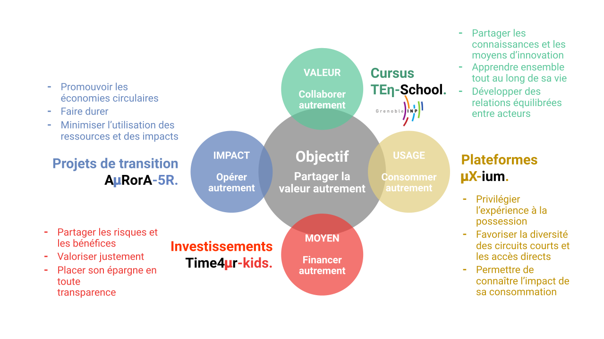
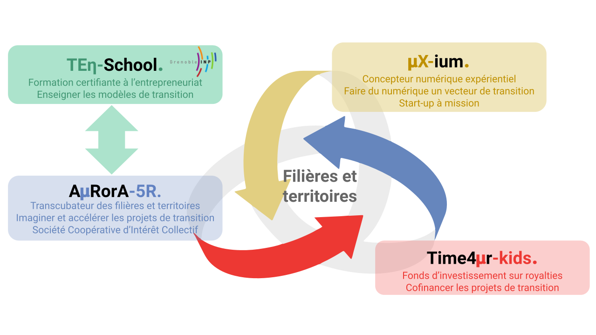
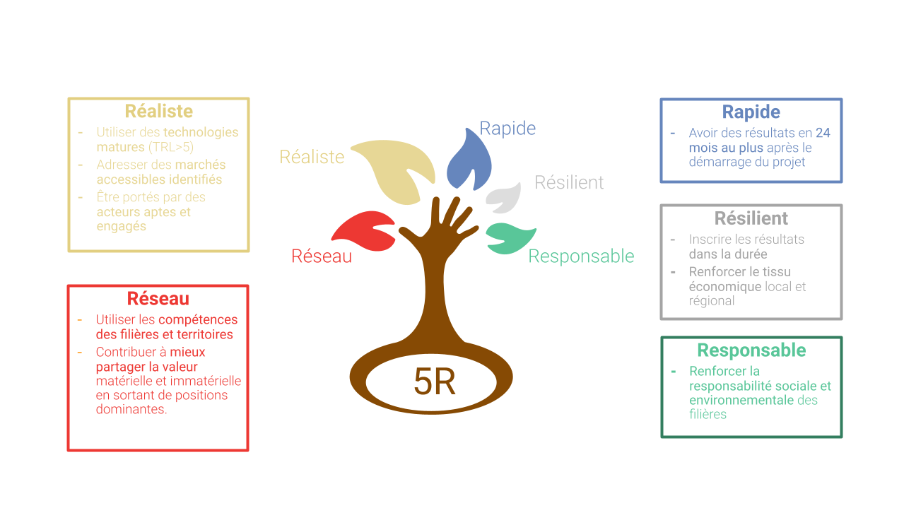
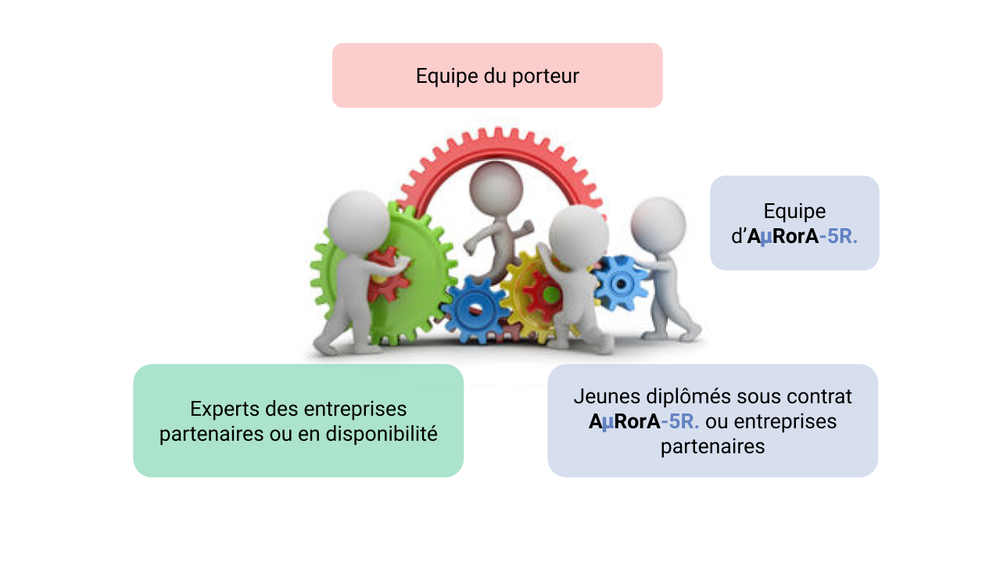

### Nos constats sur le monde actuel.

Notre société fait face à des défis environnementaux (dérèglement climatique, chute de la biodiversité …) et sociétaux directement liés aux modèles économiques et industriels déployés dans les dernières décennies.

Deux “écoles” s’affrontent (en mettant de côté les climatosceptiques et les collapsologues). Certains pensent qu’il est possible d’y répondre technologiquement sans changer les fondamentaux du système actuel (les tenants de la croissance verte) quand d’autres considèrent qu’il est indispensable de repenser le système en mettant l’économie au second plan (les décroissants). Ceux qui prônent l’économie verte sont fréquemment taxés d’être dans l’affichage et le greenwashing quand ceux préconisant une modération de la consommation et des usages sont accusés de vouloir renvoyer notre société au temps de la lampe à huile. 

Cette focalisation du débat autour de la croissance met de côté l’essentiel le remplacement progressif des activités non durables par des modèles durables, que cela impacte ou non la croissance. Bien sûr, cela aura des conséquences importantes sur la richesse moyenne disponible par individu, nécessitant des adaptations des modèles économiques et sociétaux, qui ne seront pas forcément au détriment de la qualité de vie.. Accepterions-nous de voyager avec une compagnie aérienne ou des avions d’un constructeur qui place son objectif de croissance économique au-dessus de la sécurité des vols ?

Malgré l’apparition de nouvelles technologies, principalement autour du numérique, il n’y a à ce jour aucun modèle connu pour se payer le luxe de se limiter au paradigme de la croissance verte et des adaptations incrémentales. Bien sûr, l’innovation technologique peut être porteuse de solutions, mais elle est aussi source de modèles peu responsables et de ruptures rapides fragilisant certaines filières et territoires de par leur grande vitesse de déploiement.

Si les grandes entreprises ont les moyens humains et financiers pour s’adapter, soit organiquement, soit par acquisition, à tous ces défis, cela est bien plus difficile pour les PMEs et parfois les ETIs. Et pourtant, ce sont probablement ces structures qui, de par leur agilité et leur moindre financiarisation, seraient le plus à même, avec les compétences, ressources et moyens nécessaires, de concevoir et mettre en œuvre ces nouvelles approches, au même titre que les start-ups dont le modèle est si souvent vanté et favorisé.

### Des nouveaux modèles sont à inventer.

Sur la base de ce constat, A𝝻RorA-5R. s’est fixé comme mission de permettre l’émergence de nouveaux modèles et solutions répondant à ces défis, en s’appuyant sur les acteurs du territoire avec une approche systémique par filière. Nous avons vocation à permettre aux PMEs, ETIs et start-ups de devenir des acteurs et des leaders dans les transitions nécessaires pour la création d’une économie et d’une société résilientes et responsables.

Notre expérience nous a montré qu’au cœur de ces modèles réside la manière de partager la valeur entre acteurs des filières et des territoires, afin que chacun ait les moyens d’agir autrement. Une répartition équilibrée et transparente de la valeur est le fondement de la constitution de réseaux résilients et responsables dans lesquels les transitions sont vues comme des opportunités, fondées sur la confiance entre les parties prenantes. C’est ce que nous nommons la transcubation, qui traduit la volonté d’incuber les transitions des filières et des territoires.

A ce titre, notre politique est de mettre en open source le maximum de données et d’information pour que chacun puisse les utiliser et ainsi accélérer le mouvement vers un monde résilient et responsable. Nous nous tenons à disposition pour aider et soutenir tout projet similaire à celui d’AuRorA-5R qui voudrait voir le jour dans une autre région ou dans un autre pays.

### 4 dispositifs complémentaires pour agir autrement.

1. A𝝻RorA-5R. est le centre du dispositif. Cette entité conçoit, structure, et réalise les projets de transitions avec les PMEs, ETIs ou des start-ups. Nous avons voulu que sa forme administrative et sa gouvernance reflètent sa mission. C’est pourquoi nous avons choisi une Société Coopérative d' Intérêt Collectif (SCIC).
2. Time4𝝻r-kids., en cours de création, est un fonds sur royalties, qui a pour objectif d’offrir aux PMEs un moyen de se lancer dans leurs transitions tout en partageant risques et bénéfices. Le principe sous-jacent est de fixer le remboursement du financement sur la base d’un pourcentage des ventes réalisées suite au projet, sur une durée déterminée.
3. 𝝻X-ium. est une entité développant des outils et plateformes numériques, qui remettent l'expérience et la pleine connaissance au cœur de l’acte d’achat et qui favorisent une répartition de valeur équilibrée au sein de la chaîne de valeur.
4. TEη-School. est un cursus certifiant, en cours de développement, par Grenoble-INP, un des membres fondateurs d’A𝝻RorA-5R., qui a pour objectif d’enseigner et de capitaliser ces nouveaux modèles, outils et manières de faire. Ce cursus sera à la fois accessible aux étudiants (ingénieurs, managers …) en cours de diplomation, et via la formation continue. 

### Le “5R”, référentiel structurant.

La question nous est souvent posée du pourquoi des 5R dans notre nom. 5R est pour Réseau Réaliste Rapide Résilient et Responsable. Ce sont les 5 critères qui nous servent à sélectionner et structurer les projets que nous accompagnons et réalisons.

1. Réseau: nous croyons à la force de l’intelligence collective. Si chacun apporte en confiance ses compétences et savoir-faire, les processus d’innovation peuvent être fortement accélérés et délivrer des résultats plus significatifs. La compétition est souvent mise en avant comme vecteur de réussite. Certes elle pousse à se dépasser et alimente le darwinisme économique de destruction créatrice. Mais elle est aussi source de défiance, de déséquilibre, de domination et au final des excès qui ont pour conséquence les problèmes environnementaux et sociétaux auxquels nous devons faire face aujourd’hui. Nous pensons que la confiance, la transparence, le respect et la juste valorisation de l’apport de chacun sont des valeurs structurantes pour l’avenir.
2. Réaliste: nous croyons à l’expérimentation et à la stratégie des petits pas. Le chemin vers un monde plus durable n’est pas écrit. Nous en connaissons la direction mais à nous d’en tracer les méandres. Nos projets doivent donc être réalisables, en utilisant des technologies et des moyens matures. Notre domaine est l’innovation appliquée.
3. Rapide: sur le même principe, nous recherchons des résultats rapides en 6 à 24 mois parce que les acteurs que nous accompagnons ne peuvent pas s’engager dans des programmes beaucoup plus longs mais aussi parce que nous croyons au bienfait de rapidement confronter les solutions et modèles à la réalité des filières, permettant d’apporter des améliorations éventuelles.
4. Résilient: la pandémie de la COVID 19 a démontré l’importance de la résilience du tissu social, environnemental et économique face aux chocs externes, parfois imprévisibles. Les projets que nous réalisons doivent accroître cette résilience de par leur résultat mais aussi de par la structure organisationnelle du réseau associé, liant les différents acteurs entre eux.
5. Responsable: la responsabilité sociale et environnementale est au cœur de la mission d’A𝝻RorA-5R. et donc des projets que nous accompagnons. Néanmoins, si nous recherchons l’exemplarité, nous sommes conscients qu’il peut être nécessaire de faire des compromis, le chemin à parcourir étant long et sinueux. Le principal est de parcourir un bout de ce chemin avec toutes ses imperfections. Une transition est le passage d’un état A à un état B, nous acceptons que cela peut demander du temps (tant que cela reste dans des limites raisonnables) et une adaptation progressive de chacun.

### Des équipes projets uniques.

Au même titre que nous plaçons la confiance et la collaboration comme des pierres angulaires des modèles résilients et responsables, nous bâtissons nos équipes projet sur ce même modèle. Nous construisons nos équipes projet sur la base des besoins des projets à chaque étape, en faisant travailler ensemble:

1. les équipes du porteur et des autres entreprises impliquées dans le projet,
2. des jeunes diplômés sous contrat avec A𝝻RorA-5R. ou des entreprises partenaires, venant des écoles d’ingénieurs, de management ou autres du territoire,
3. des experts mis à disposition par leurs entreprises ou en disponibilité,
4. les équipes d’A𝝻RorA-5R. assurant l’application des méthodes et outils appropriés et la cohérence de la démarche globale

Ce mélange entre discipline et génération construit sur la confiance et le respect mutuel, permet à chacun de s’enrichir au contact des autres, d’apporter la créativité et les savoir-faire nécessaires, et in fine d’assurer la pertinence et la performance de l’équipe tout au long de la réalisation du projet. De par le style de gouvernance des projets chaque personne ayant participé à un projet d’A𝝻RorA-5R. aura parcouru un morceau de sa propre transition dans son développement et son épanouissement personnel, ainsi que dans la construction de son parcours professionnel. Nos méthodes et outils de management de l’innovation et de gestion de projet agile et pragmatique, s’appuient sur le développement de l’autonomie et donnent à chacun la possibilité de renforcer son assertivité et d’apporter sa contribution, et ainsi de participer pleinement au succès collectif.

