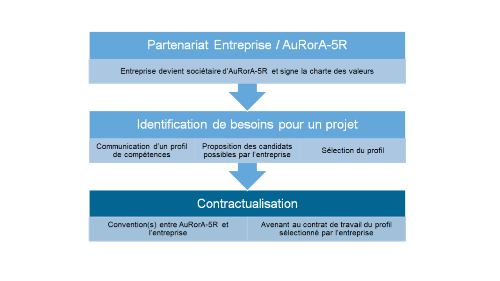
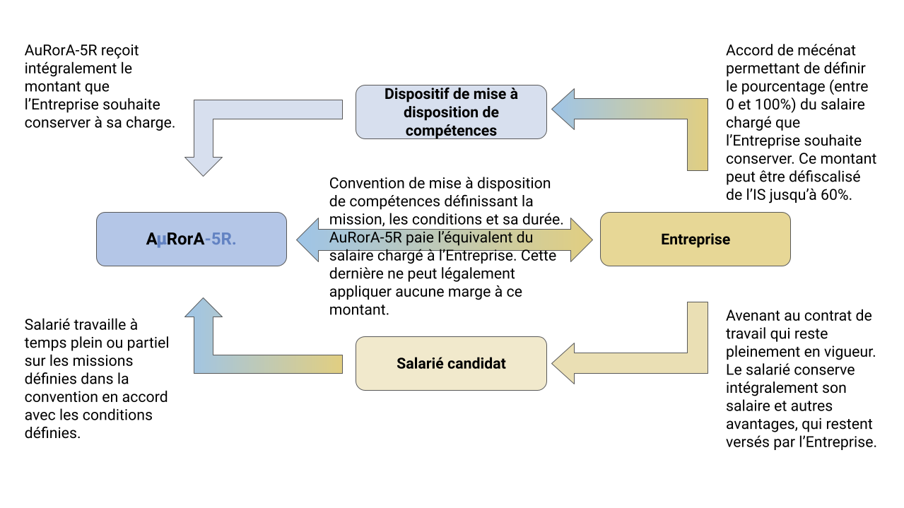

Pourquoi devenir partenaire ?
-----------------------------

Toutes les organisations se développent au sein d’un territoire et d’un écosystème. Même si une entreprise a une vocation économique, elle interagit en permanence avec les individus, les sociétés et les environnements dans lesquels elle évolue. A ce titre, elle se doit de contribuer à trouver des réponses aux attentes et aux défis de ce siècle.

Il peut néanmoins être difficile de repenser les modèles, d’innover et d’expérimenter dans un cadre souvent contraint par les objectifs opérationnels et financiers, fixés sur la base et l’optimisation des modèles industriels et économiques actuels.

Que ce soit pour les entreprises ou les les institutions, devenir partenaire d’A𝝻RorA-5R., c’est devenir acteur dans la conception, l’expérimentation et le développement de modèles et de solutions contribuant à la construction d’un monde résilient et responsable, au-delà de sa propre activité et de ses propres possibilités.

Quels sont les bénéfices d’être partenaire ?
--------------------------------------------

Être partenaire d’A𝝻RorA-5R. c’est:

1. Développer votre marque employeur auprès des jeunes diplômés. 25% à 30% des étudiants n’arrivent pas à se projeter dans une économie qui ne se met pas en priorité au service de la société. Ils recherchent du sens et la capacité de construire un monde dans lequel ils, et leurs enfants, pourront s’épanouir. 
2. Motiver et former vos talents. Nombre de personnes font face à un moment de leur carrière à un questionnement sur l’impact de leur travail avec le besoin de découvrir d’autres horizons. Participer à un projet d’A𝝻RorA-5R. avec des jeunes diplômés est un moyen pour vos talents de se ressourcer tout en se formant de manière originale et différente des formations traditionnelles.
3. Enrichir vos connexions avec l’écosystème régional au travers des partenaires et clients d’A𝝻RorA-5R.
4. Renforcer l’intégration de votre stratégie et vos actions RSE, et si possible en en faisant bénéficier certains de vos fournisseurs ou partenaires.

Concrètement, à quoi cela vous engage-t-il ?
--------------------------------------------

Pour devenir partenaire d’A𝝻RorA-5R. vous devez:

1. Devenir sociétaire d’A𝝻RorA-5R. La part sociale est fixée à 200€ et le nombre de parts sociales minimum à souscrire dépend de la taille de votre société. Cela va de 2 parts pour les TPE à 50 pour les ETI et grandes entreprises. En tant que sociétaire, vous intégrerez le collège des Clients et partenaires de la SCIC qui dispose d’une poids de 15% et d’un à deux administrateurs ([statuts](https://www.google.com/url?q=https://aurora-5r.fr/statuts&sa=D&source=editors&ust=1613306730452000&usg=AOvVaw2fOxCjBSb1gcZXV7r2mxnE)).
2. Signer et respecter la [charte partenaire](https://www.google.com/url?q=https://docs.google.com/document/d/e/2PACX-1vQwWUyI4X3eBLNEjgw5Xx-aHhT-uKhR94-Y5OSm9vX_atUSF9lhLXGendhROUV0JnPCvv_dhnt1WgMa/pub&sa=D&source=editors&ust=1613306730453000&usg=AOvVaw3rM-BaihIWV7yg4HKfn7AZ) principalement sur les aspects de responsabilité sociale et environnementale.
3. Favoriser l’intervention de vos talents sur les projets d’A𝝻RorA-5R. via le dispositif de mise à disposition de compétences.

Aller plus loin dans le support à la mission d’A𝝻RorA-5R.?
----------------------------------------------------------

Si vous souhaitez aller plus loin dans votre support à la mission d’A𝝻RorA-5R., vous pouvez:

1. Promouvoir A𝝻RorA-5R. et ses valeurs auprès de votre propre réseau et écosystème
2. Proposer des projets
3. Investir dans le fonds [Time4𝝻r-kids](https://aurora-5r.fr/pages/time4ur-kids)
4. 
5. Investir dans des parts sociales supplémentaires d’A𝝻RorA-5R.

Lien vers la [charte partenaire](https://www.google.com/url?q=https://docs.google.com/document/d/e/2PACX-1vQwWUyI4X3eBLNEjgw5Xx-aHhT-uKhR94-Y5OSm9vX_atUSF9lhLXGendhROUV0JnPCvv_dhnt1WgMa/pub&sa=D&source=editors&ust=1613306730455000&usg=AOvVaw04sUDZbN-uU1UnM7xC7jf8).

Pour en savoir plus, n’hésitez pas à nous [contacter](https://aurora-5r.fr/pages/Contact)

.

